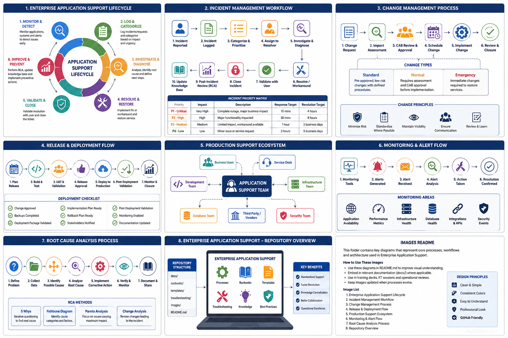

# 🚀 Enterprise Application Support Playbook

<p align="center">
  
</p>

A practical knowledge repository covering enterprise application support, production operations, troubleshooting, ITIL processes, Azure application support, runbooks, templates, and operational best practices.

> A comprehensive guide to Enterprise Application Support, L2/L3 Production Support, Incident Management, Release Management, Root Cause Analysis, and Operational Excellence.


---

# 📖 Overview

Enterprise Application Support is much more than resolving production incidents. It involves maintaining application reliability, ensuring business continuity, supporting production releases, troubleshooting complex issues, and continuously improving operational efficiency.

This repository serves as a practical knowledge base for professionals working in Enterprise Application Support, L2/L3 Production Support, Technical Operations, Platform Support, and DevOps environments.

Whether you're a beginner learning enterprise support or an experienced engineer looking for structured documentation and best practices, this repository is designed to help.

---

# 🎯 Objectives

This repository aims to provide:

- Enterprise Application Support concepts
- L2/L3 Production Support practices
- Incident Management
- Problem Management
- Change Management
- Release Management
- Root Cause Analysis (RCA)
- Operational Runbooks
- Troubleshooting Guides
- Production Checklists
- Reusable Templates
- Best Practices

---

# 👨‍💻 Who Should Use This Repository?

This repository is designed for:

- Application Support Engineers
- Production Support Engineers
- Technical Leads
- DevOps Engineers
- Site Reliability Engineers (SRE)
- System Administrators
- Software Engineers
- Technical Consultants
- IT Operations Teams
- Students interested in Enterprise Support

---

# 📂 Repository Structure

```
enterprise-application-support-playbook/

📁 docs/
📁 runbooks/
📁 troubleshooting/
📁 templates/
📁 images/

README.md
LICENSE
CONTRIBUTING.md
```

---

# 📚 Documentation

| Topic | Description |
|--------|-------------|
| Introduction | Enterprise Application Support fundamentals |
| Support Lifecycle | End-to-end application support process |
| Incident Management | Incident lifecycle, priorities, SLAs |
| Major Incident Management | Critical incident handling |
| Problem Management | Root Cause Analysis and prevention |
| Change Management | Safe production changes |
| Release Management | Deployment planning and validation |
| Production Best Practices | Daily operational excellence |
| Knowledge Management | Documentation and knowledge sharing |

---

# 🛠 Troubleshooting Guides

Topics include:

- SQL Server
- REST APIs
- SOAP APIs
- Microsoft IIS
- Windows Server
- Splunk
- Application Performance
- Production Incidents

---

# 📋 Operational Runbooks

Practical checklists for:

- Production Health Checks
- Deployments
- Smoke Testing
- Rollback Procedures
- Server Restart Validation

---

# 📑 Templates

Reusable templates for:

- Incident Reports
- RCA Documents
- Change Requests
- Release Checklists

---

# 💻 Technology Stack

- .NET Framework
- SQL Server
- Azure DevOps
- REST APIs
- SOAP APIs
- Microsoft IIS
- Windows Server
- Splunk
- Git
- GitHub

---

# 🌟 Best Practices

✔ Follow documented procedures

✔ Perform impact analysis before changes

✔ Document every production incident

✔ Validate deployments using smoke tests

✔ Maintain rollback plans

✔ Conduct Root Cause Analysis for recurring issues

✔ Keep operational documentation up to date

✔ Promote knowledge sharing within teams

---

# 📈 Repository Roadmap

## Phase 1

- Repository Structure
- Introduction
- Incident Management

## Phase 2

- Problem Management
- Change Management
- Release Management

## Phase 3

- Runbooks
- Troubleshooting Guides

## Phase 4

- Architecture Diagrams
- Flowcharts
- Visual Documentation

## Phase 5

- Automation Examples
- PowerShell Scripts
- SQL Utilities

---

# 🤝 Contributing

Contributions are welcome!

If you'd like to improve this repository:

- Suggest enhancements
- Report issues
- Improve documentation
- Share best practices
- Submit pull requests

---

# ⚠ Disclaimer

This repository contains generic guidance, educational examples, and industry best practices.

It does **not** contain confidential code, proprietary documentation, customer data, or internal processes from any employer or client.

---

# 📬 Connect With Me

- LinkedIn: https://www.linkedin.com/in/muzammilnadaf/
- GitHub: https://github.com/muzammilnadaf

---

⭐ If you find this repository useful, consider giving it a star!
