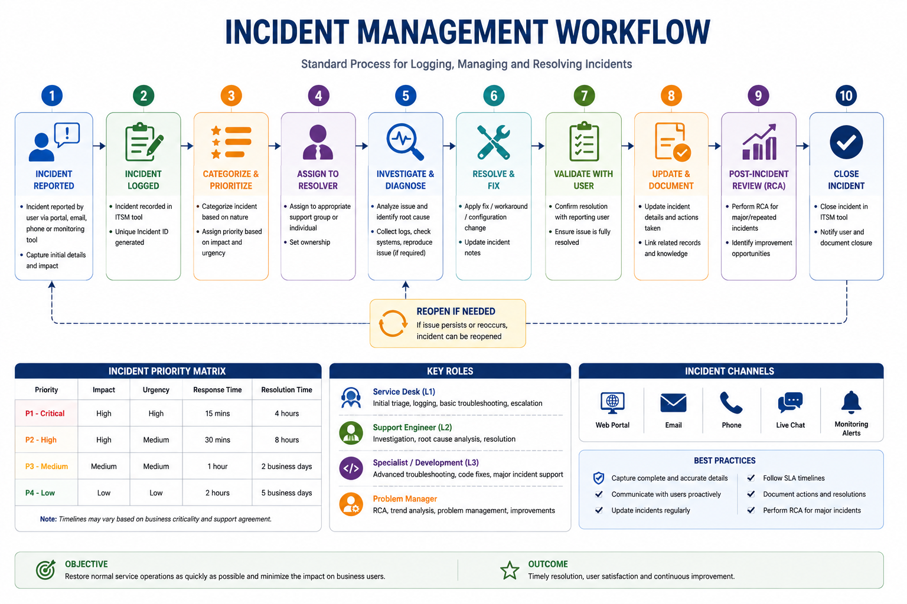

# Incident Management

  

## 1. Overview

Incident Management is the process of identifying, analyzing, resolving, and documenting issues that impact application availability, functionality, or user experience.

The primary objective is to restore normal service as quickly as possible while ensuring proper communication, tracking, and learning from incidents.

A successful incident management process focuses on:

- Faster restoration of services
- Clear ownership
- Effective communication
- Accurate troubleshooting
- Prevention of repeat issues

---

# 2. Incident Lifecycle

A typical incident follows these stages:

Detection
 &#11015; 
Logging
 &#11015; 
Classification
 &#11015; 
Prioritization
 &#11015; 
Assignment
 &#11015; 
Investigation
 &#11015; 
Resolution
 &#11015; 
Validation
 &#11015; 
Closure

---

# 3. Incident Detection

Incidents can be identified through:

- User reported issues
- Monitoring alerts
- Automated notifications
- Business team escalation
- Support team observations

Common examples:

- Application unavailable
- Slow response time
- Transaction failure
- API errors
- Batch job failure
- Database connectivity issues

---

# 4. Incident Logging

Every incident should have sufficient information before investigation begins.

## Minimum Ticket Information

- Incident summary
- Application/service name
- Reported time
- Affected users or business area
- Issue description
- Error messages
- Screenshots/logs if available
- Business impact
- Initial checks performed

Poor ticket details increase investigation time and unnecessary back-and-forth communication.

---

# 5. Incident Categorization

Correct categorization helps route incidents to the right team.

Common categories:

| Category | Examples |
|---|---|
| Application | Functional errors, application crashes |
| Database | Query failures, data issues |
| Integration | API failures, message failures |
| Infrastructure | Server, network, storage issues |
| Access | Authentication and authorization issues |
| Deployment | Release-related problems |

---

# 6. Incident Priority

Incident priority is decided based on business impact and urgency.

## Priority Matrix

| Priority | Description | Example |
|---|---|---|
| P1 - Critical | Complete service disruption | Application unavailable for all users |
| P2 - High | Major functionality impacted | Critical business process failing |
| P3 - Medium | Limited impact | Issue affecting few users |
| P4 - Low | Minor issue/request | Information or cosmetic issue |

---

# 7. Incident Triage

Triage is the initial technical assessment performed to understand the issue.

## Triage Checklist

### Understand the Impact

Check:

- Number of affected users
- Business process impacted
- Application components affected
- Start time of issue

### Check Recent Changes

Review:

- Recent deployments
- Configuration changes
- Infrastructure changes
- Database changes

### Validate Application Health

Check:

- Application availability
- Server status
- Database connectivity
- External dependencies
- Monitoring alerts

---

# 8. Investigation Approach

A structured investigation avoids random troubleshooting.

## Step 1: Collect Evidence

Review:

- Application logs
- Error messages
- Monitoring dashboards
- Database records
- API responses
- Server logs

## Step 2: Identify Failure Area

Determine whether the issue is related to:

- Frontend
- Backend service
- Database
- Integration
- Infrastructure
- Security configuration

## Step 3: Apply Resolution

Possible resolutions:

- Configuration correction
- Service restart
- Data correction
- Dependency recovery
- Deployment rollback
- Code fix

---

# 9. Incident Communication

Communication is critical during production incidents.

Updates should include:

- Current issue status
- Impact assessment
- Investigation progress
- Actions completed
- Next planned activity
- Expected update time

## Communication Guidelines

- Share confirmed information only
- Avoid technical assumptions
- Keep stakeholders updated
- Escalate risks early

---

# 10. Major Incident Management

Major incidents require additional coordination due to high business impact.

Examples:

- Complete application outage
- Multiple business functions impacted
- Critical customer-facing failure
- Data integrity concerns

## Major Incident Activities

- Assign incident owner
- Create communication bridge/war room
- Coordinate technical teams
- Track investigation progress
- Provide regular updates
- Document timeline

---

# 11. Workaround Management

A workaround restores business operations without permanently fixing the underlying issue.

Examples:

- Manual data correction
- Temporary configuration change
- Alternate processing method
- Service restart procedure

A workaround should:

- Be documented
- Have clear execution steps
- Include risks
- Be followed by permanent resolution planning

---

# 12. Incident Resolution and Validation

Before closing an incident, verify:

- Application functionality restored
- Business process working correctly
- Monitoring shows healthy status
- Users confirm resolution
- Required documentation updated

Resolution details should clearly mention:

- Issue cause (if identified)
- Actions performed
- Validation completed

---

# 13. Incident Closure

An incident can be closed after:

- Resolution is confirmed
- Required approvals are completed
- All updates are documented
- Related tasks are created if required

Closure should include:

- Final resolution summary
- Root cause reference (if available)
- Preventive actions
- Knowledge article reference

---

# 14. Incident Review

Important incidents should be reviewed after resolution.

Review areas:

- What happened?
- Why did it happen?
- What was the impact?
- What went well?
- What needs improvement?

The outcome should help improve future response.

---

# 15. Incident Management Best Practices

- Take ownership until resolution or proper handover
- Check impact before making changes
- Document troubleshooting steps during investigation
- Avoid repeated manual fixes without analysis
- Keep stakeholders informed
- Convert repeated incidents into problem records
- Maintain accurate knowledge documentation

---

# 16. Summary

Effective Incident Management ensures production issues are handled in a controlled manner with proper ownership, communication, and technical investigation.

A mature incident management approach helps teams:

- Restore services faster
- Reduce business impact
- Improve troubleshooting efficiency
- Prevent recurring failures

---

**Document Purpose:** Enterprise Incident Management Guide  
**Version:** 1.0
