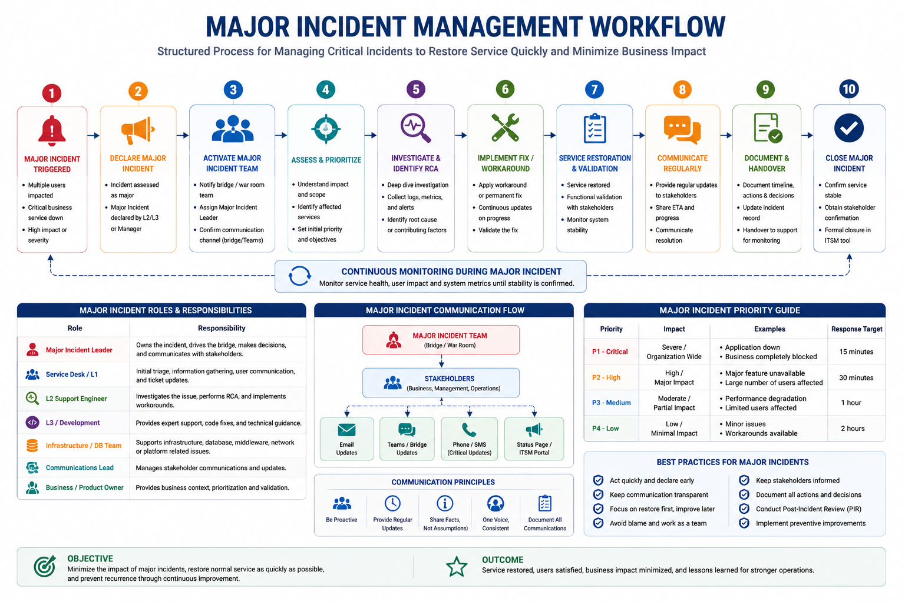

# Major Incident Management

The following workflow provides an overview of the major incident management process used to restore critical business services as quickly as possible. It highlights major incident declaration, stakeholder communication, technical investigation, service restoration, validation, documentation, and post-incident review.

  

## 1. Overview

A Major Incident is a high-impact production issue that significantly affects business operations, customers, critical services, or application availability.

Major incidents require immediate attention, coordinated troubleshooting, and frequent communication until service is restored.

The primary objective is:

- Restore service as quickly as possible
- Minimize business impact
- Maintain effective coordination
- Capture learnings after resolution

---

# 2. Major Incident Identification

An incident is treated as a Major Incident when one or more of the following conditions exist:

- Complete application outage
- Critical business process unavailable
- Large number of users impacted
- Customer-facing service disruption
- Significant data integrity concern
- No available workaround
- SLA breach risk for critical services

Final classification should be based on business impact, not only technical severity.

---

# 3. Major Incident Activation

Once identified as a Major Incident:

1. Confirm impact and severity
2. Assign Major Incident Owner
3. Notify required support teams
4. Start incident bridge/war room
5. Begin regular stakeholder communication

The incident owner controls coordination until service restoration.

---

# 4. Major Incident Roles

## Major Incident Manager

Responsible for overall coordination.

Responsibilities:

- Own incident communication
- Coordinate technical teams
- Track progress
- Manage timelines
- Escalate when required
- Ensure proper documentation

## Technical Lead

Responsible for technical direction.

Responsibilities:

- Drive troubleshooting approach
- Assign technical activities
- Review findings
- Coordinate between technical teams
- Recommend recovery actions

## Application Support Team

Responsibilities:

- Analyze application behaviour
- Review logs and errors
- Perform application-level checks
- Validate fixes
- Provide technical updates

## Infrastructure / Database / Other Teams

Responsibilities:

- Investigate their respective areas
- Provide findings quickly
- Execute approved recovery actions
- Support service restoration

---

# 5. War Room Management

A war room provides a single channel for technical investigation and decision making.

## War Room Guidelines

- Keep discussions focused on resolution
- Assign clear action owners
- Record important decisions
- Avoid parallel troubleshooting without coordination
- Share updates at agreed intervals

## War Room Information Tracking

Maintain:

- Issue summary
- Impact details
- Timeline
- Actions performed
- Current investigation status
- Pending activities
- Next steps

---

# 6. Initial Assessment

The first objective is understanding the impact and stabilizing the situation.

Key checks:

- What is failing?
- When did it start?
- How many users are affected?
- Is the entire application impacted?
- Was there any recent change?
- Is a workaround available?

Avoid making unverified changes during initial analysis.

---

# 7. Recovery Approach

Major incident recovery should focus on restoring service first.

Possible recovery actions:

- Restart failed services
- Roll back recent deployments
- Restore failed integrations
- Apply temporary configuration changes
- Failover to backup systems
- Correct data issues

Permanent fixes should be handled separately if they require additional analysis.

---

# 8. Communication Management

Major incidents require timely and accurate communication.

## Internal Updates

Share:

- Current impact
- Investigation progress
- Actions completed
- Risks identified
- Next update timeline

## Business Updates

Communication should focus on:

- Business impact
- Service availability
- Expected recovery timeline
- Workaround availability

Avoid sharing unnecessary technical details with business stakeholders.

---

# 9. Escalation Management

Escalation should happen when:

- Recovery progress is blocked
- Required expertise is unavailable
- Business impact increases
- SLA breach risk exists
- Additional approvals are required

Escalation should provide:

- Current situation
- Impact
- Actions completed
- Support required

---

# 10. Major Incident Timeline

Maintain an accurate timeline during the incident.

Example:

| Time | Activity |
|---|---|
| 10:00 | Monitoring alert received |
| 10:05 | Incident confirmed |
| 10:15 | Technical teams engaged |
| 10:45 | Root cause investigation started |
| 11:30 | Recovery action implemented |
| 12:00 | Service restored |

The timeline is important for RCA and future improvements.

---

# 11. Service Restoration Validation

Before announcing resolution, validate:

- Application availability
- Critical business transactions
- Integration health
- Monitoring status
- User confirmation

Service restoration should be confirmed by both technical and business teams where required.

---

# 12. Post Incident Activities

After resolving a Major Incident:

## RCA Preparation

Document:

- Incident summary
- Business impact
- Timeline
- Technical investigation
- Root cause
- Resolution
- Preventive actions

## Improvement Actions

Identify:

- Monitoring improvements
- Automation opportunities
- Process gaps
- Documentation updates
- Technical improvements

---

# 13. Major Incident Review Meeting

A review meeting should focus on improvement, not blame.

Discussion points:

- What happened?
- How was it detected?
- How effective was the response?
- What delayed resolution?
- What actions will prevent recurrence?

---

# 14. Major Incident Best Practices

- Assign one owner for coordination
- Keep communication regular and factual
- Focus on restoration before detailed analysis
- Record all major decisions
- Avoid multiple teams making uncoordinated changes
- Capture learnings after every major incident
- Track preventive actions until completion

---

# 15. Summary

Major Incident Management provides a structured approach for handling critical production failures.

A strong major incident process ensures:

- Faster recovery
- Better coordination
- Clear accountability
- Reduced business impact
- Continuous improvement

---

**Document Purpose:** Enterprise Major Incident Management Guide  
**Version:** 1.0
