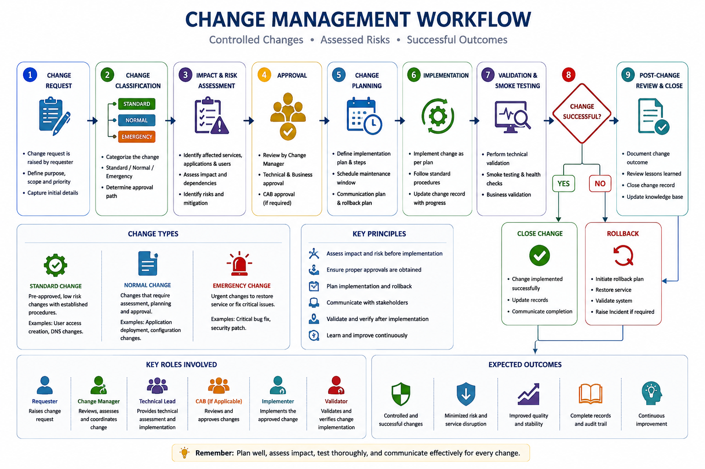

# Change Management

The following workflow provides an overview of the Change Management process used to assess, approve, implement, validate, and close changes in enterprise application environments. It highlights change classification, impact and risk assessment, approval, implementation planning, deployment, validation, rollback handling, and post-change review.

  

## 1. Overview

Change Management ensures that modifications to applications, infrastructure, databases, configurations, and integrations are implemented in a controlled and predictable manner.

The objective is to introduce required changes while minimizing risk to production environments.

A controlled change process helps teams:

- Reduce production failures
- Maintain application stability
- Improve deployment confidence
- Ensure proper approvals and tracking
- Maintain audit compliance

---

# 2. Types of Changes

## Standard Change

A pre-approved, low-risk change performed using an established procedure.

Examples:

- Routine service restart
- User access update
- Scheduled maintenance activity
- Known configuration update

---

## Normal Change

A planned change requiring assessment and approval.

Examples:

- Application release deployment
- Database modification
- Configuration change
- Infrastructure update

---

## Emergency Change

A change required to resolve a critical issue immediately.

Examples:

- Production outage fix
- Critical security patch
- Urgent defect correction

Emergency changes require minimum necessary approvals and proper documentation after implementation.

---

# 3. Change Management Lifecycle

Change Request
 &#11015; 
Impact Assessment
 &#11015; 
Risk Analysis
 &#11015; 
Approval
 &#11015; 
Implementation Planning
 &#11015; 
Execution
 &#11015; 
Validation
 &#11015; 
Closure

---

# 4. Change Request Creation

Every change should have complete details before review.

## Required Information

- Change description
- Business reason
- Affected application/component
- Implementation plan
- Testing evidence
- Risk assessment
- Downtime requirement
- Rollback plan
- Implementation timeline
- Responsible owner

Incomplete change requests increase implementation risk.

---

# 5. Impact and Risk Assessment

Before approval, evaluate the potential impact.

## Impact Assessment

Consider:

- Number of users affected
- Business criticality
- Application dependencies
- Integration impact
- Expected downtime

## Risk Assessment

Evaluate:

- Probability of failure
- Impact if change fails
- Recovery complexity
- Rollback feasibility

Risk should be clearly documented before implementation.

---

# 6. Change Approval Process

Changes should be approved by appropriate stakeholders.

Typical approvals include:

- Application owner
- Technical lead
- Business owner
- Infrastructure team
- Change Advisory Board (CAB), if applicable

Approval ensures that:

- Risks are understood
- Dependencies are reviewed
- Implementation timing is appropriate

---

# 7. Change Implementation Planning

A good implementation plan should include:

## Pre-Implementation Activities

- Confirm approvals
- Validate deployment package
- Take required backups
- Verify access
- Notify stakeholders

## Implementation Steps

Document:

- Exact execution sequence
- Commands/scripts if required
- Responsible person
- Expected completion time

## Post-Implementation Activities

- Application validation
- Monitoring verification
- Business validation
- Stakeholder confirmation

---

# 8. Rollback Planning

Every production change should have a rollback strategy.

Rollback plan should define:

- When rollback will be triggered
- Steps to restore previous state
- Responsible owner
- Expected recovery time

Rollback triggers may include:

- Application failure
- Performance degradation
- Data issues
- Business validation failure

---

# 9. Change Execution

During implementation:

- Follow approved steps
- Avoid unplanned modifications
- Record actual activities performed
- Monitor system behaviour
- Communicate progress

Any deviation from the approved plan should be documented.

---

# 10. Post Change Validation

After implementation, validate:

## Application Checks

- Application availability
- Critical business functions
- User transactions

## Technical Checks

- Logs reviewed
- Monitoring status confirmed
- Integrations validated
- Database connectivity checked

---

# 11. Change Failure Handling

If a change causes issues:

1. Assess impact
2. Initiate rollback if required
3. Communicate status
4. Restore service
5. Create incident record
6. Review change failure

Failed changes should be analyzed to prevent recurrence.

---

# 12. Change Closure

A change can be closed after:

- Implementation completed
- Validation successful
- Documentation updated
- Required evidence attached
- Stakeholders informed

Closure details should include:

- Actual implementation outcome
- Issues encountered
- Final status
- Follow-up actions

---

# 13. Change Calendar Management

A change calendar helps teams coordinate production activities.

It tracks:

- Planned deployments
- Maintenance windows
- Infrastructure changes
- Application releases
- Restricted periods

Benefits:

- Avoids conflicting changes
- Improves coordination
- Reduces operational risk

---

# 14. Change Management Metrics

Common metrics:

## Change Success Metrics

- Successful changes
- Failed changes
- Rollback frequency
- Emergency changes count

## Operational Metrics

- Change approval time
- Deployment duration
- Post-change incidents
- Change-related outages

---

# 15. Change Management Best Practices

- Always test before production implementation
- Maintain a clear rollback plan
- Avoid undocumented production changes
- Communicate impact before execution
- Record actual implementation details
- Review failed changes
- Automate repeatable deployment activities

---

# 16. Summary

Change Management provides a structured approach for implementing production modifications safely.

A mature change process ensures:

- Controlled releases
- Reduced operational risk
- Better collaboration
- Improved application stability
- Traceability of production activities

---

**Document Purpose:** Enterprise Change Management Guide  
**Version:** 1.0
