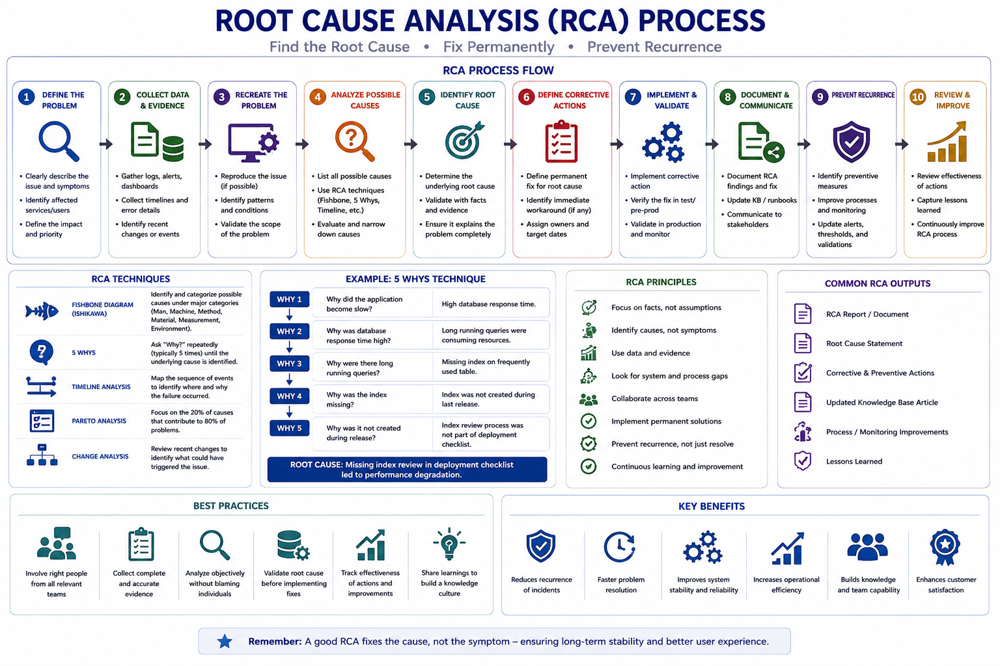

# Root Cause Analysis (RCA)

The following workflow provides an overview of the Root Cause Analysis (RCA) process used to investigate significant or recurring production incidents and identify the underlying causes rather than addressing only the immediate symptoms. It highlights problem definition, evidence collection, timeline analysis, contributing-factor identification, root cause determination, corrective and preventive actions, validation, documentation, and follow-up.

  

## 1. Overview

Root Cause Analysis (RCA) is a structured approach used to identify the actual reason behind an incident or failure.

The purpose of RCA is not only to explain what happened but also to identify why it happened and what actions are required to prevent recurrence.

A good RCA should provide:

- Clear understanding of the failure
- Actual root cause
- Corrective actions
- Preventive measures
- Improvement opportunities

---

# 2. When RCA Is Required

RCA is typically performed for:

- Major incidents
- Repeated production issues
- Business-critical failures
- Data integrity issues
- Security-related incidents
- Performance degradation
- Issues requiring permanent fixes

The depth of RCA depends on business impact and incident complexity.

---

# 3. RCA Approach

A typical RCA process follows these steps:

Collect Information
 &#11015; 
Understand Timeline
 &#11015; 
Analyze Evidence
 &#11015; 
Identify Root Cause
 &#11015; 
Define Corrective Actions
 &#11015; 
Implement Improvements
 &#11015; 
Review Effectiveness

---

# 4. Information Collection

Before starting analysis, collect all relevant details.

## Incident Details

Capture:

- Incident summary
- Impact description
- Affected application/component
- Start and recovery time
- Number of affected users
- Business impact

## Technical Information

Collect:

- Application logs
- Server logs
- Database logs
- Monitoring alerts
- Deployment history
- Configuration changes
- Error messages

## Environment Details

Review:

- Application version
- Infrastructure details
- Recent changes
- Dependencies
- Third-party services

---

# 5. Incident Timeline

A timeline helps understand the sequence of events.

Example:

| Time | Activity |
|---|---|
| 09:30 | Monitoring alert triggered |
| 09:35 | Issue confirmed by support team |
| 09:50 | Application logs reviewed |
| 10:15 | Root cause identified |
| 10:45 | Fix implemented |
| 11:00 | Service validated |

A clear timeline helps identify delays and improvement areas.

---

# 6. Identifying Root Cause

The root cause should explain the actual reason behind the failure.

Avoid documenting symptoms as root causes.

Example:

Incorrect:

Application was down because users could not access the system.

Correct:

Application became unavailable because the application service stopped after exceeding available memory due to an unoptimized background process.

The root cause should explain:

- What failed?
- Why did it fail?
- Why was it not detected earlier?

---

# 7. RCA Analysis Techniques

## Five Whys Analysis

Used to find the underlying reason by repeatedly asking "Why".

Example:

Problem:
Order processing failed.

Why?
Database transaction failed.

Why?
Database connection timeout occurred.

Why?
Connection pool reached its limit.

Why?
Application was not releasing connections properly.

Why?
Connection handling logic had a defect.

Root Cause:
Application defect causing connection leaks.

---

## Fishbone Analysis

Used for complex issues by analyzing different categories.

Common categories:

- Application
- Infrastructure
- Database
- Process
- People
- Configuration
- External dependency

---

# 8. Technical RCA Areas

## Application Layer

Analyze:

- Code changes
- Exception handling
- Memory usage
- Configuration
- Application behaviour

## Database Layer

Analyze:

- Query performance
- Blocking
- Deadlocks
- Data issues
- Database availability

## Infrastructure Layer

Analyze:

- Server health
- Resource utilization
- Network connectivity
- Service availability

## Integration Layer

Analyze:

- API failures
- Authentication issues
- Timeout errors
- Dependency failures

---

# 9. Corrective Actions

Corrective actions address the current issue.

Examples:

- Fix application defect
- Correct configuration
- Optimize database query
- Restart affected service
- Apply required patch

Corrective actions should restore normal behaviour.

---

# 10. Preventive Actions

Preventive actions reduce the possibility of similar failures.

Examples:

- Add monitoring alerts
- Improve logging
- Automate validation checks
- Update documentation
- Improve testing coverage
- Implement capacity planning

Preventive actions should focus on long-term improvement.

---

# 11. RCA Document Structure

A standard RCA document should contain:

## Incident Summary

Brief explanation of what happened.

## Business Impact

Details about:

- Users affected
- Business processes impacted
- Duration of impact

## Timeline

Sequence of important events.

## Technical Analysis

Investigation details and findings.

## Root Cause

Actual reason behind the failure.

## Resolution

Actions taken to restore service.

## Corrective and Preventive Actions

Actions planned to avoid recurrence.

---

# 12. Common RCA Mistakes

Avoid:

- Writing symptoms instead of root cause
- Blaming individuals
- Missing technical evidence
- Providing incomplete timelines
- Closing RCA without preventive actions
- Focusing only on immediate fixes

---

# 13. RCA Review

Before finalizing an RCA, verify:

- Root cause is technically accurate
- Evidence supports the conclusion
- Actions are clearly assigned
- Preventive measures are realistic
- Similar risks are considered

---

# 14. RCA Best Practices

- Start analysis with facts, not assumptions
- Use logs and evidence for conclusions
- Involve relevant technical teams
- Document learnings clearly
- Track preventive actions until completion
- Convert repeated failures into improvement opportunities

---

# 15. Summary

Root Cause Analysis helps teams move from fixing problems repeatedly to preventing them permanently.

A well-prepared RCA provides:

- Better understanding of failures
- Faster future troubleshooting
- Reduced recurring incidents
- Improved application reliability
- Continuous operational improvement

---

**Document Purpose:** Enterprise Root Cause Analysis Guide  
**Version:** 1.0
