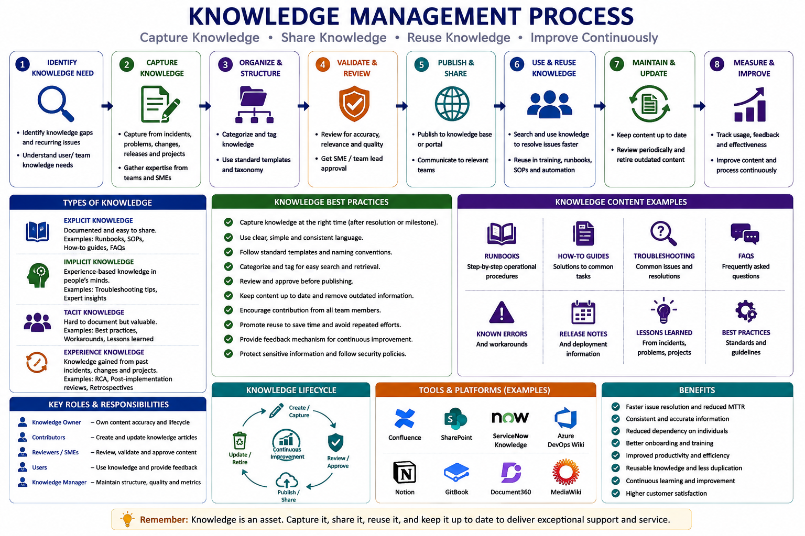

# Knowledge Management

The following workflow provides an overview of the Knowledge Management process used to capture, organize, validate, share, reuse, and continuously improve operational knowledge within enterprise application support teams. It highlights knowledge identification, knowledge capture, organization, review and validation, publication, reuse, maintenance, and measurement, along with common knowledge types, content examples, roles, tools, and benefits.

  

## 1. Overview

Knowledge Management is the process of capturing, organizing, maintaining, and sharing application-related information to improve support efficiency.

In production support, knowledge should not remain limited to individual team members. Important technical findings, resolutions, and operational procedures should be documented and made available to the entire team.

The objective of Knowledge Management is to:

- Reduce dependency on individual knowledge
- Improve issue resolution speed
- Enable faster onboarding of new team members
- Maintain consistent support practices
- Preserve operational experience

---

# 2. Types of Knowledge Documentation

Enterprise support teams maintain different types of knowledge documents.

## Knowledge Articles

Used for common issues and their resolutions.

Examples:

- Application errors
- User issues
- Configuration problems
- Common troubleshooting steps

## Troubleshooting Guides

Used for technical investigation.

Examples:

- Application not responding
- API failures
- Database connectivity issues
- Performance issues

## Operational Procedures

Used for regular support activities.

Examples:

- Application health checks
- Service restart procedures
- Batch monitoring
- Deployment validation

## Known Issues

Used for issues where:

- Root cause is identified
- Workaround is available
- Permanent fix is pending

---

# 3. Knowledge Creation Process

Knowledge should be created whenever valuable information is identified.

Common sources:

- Resolved incidents
- Major incident reviews
- RCA documents
- Production fixes
- Application changes
- Support team experience

Knowledge creation process:

Identify Useful Information
 &#11015; 
Document Solution
 &#11015; 
Review Accuracy
 &#11015; 
Publish Knowledge
 &#11015; 
Maintain Regularly

---

# 4. Knowledge Article Structure

A good knowledge article should contain:

## Title

Use a clear and searchable title.

Example:

Application Login Failure Due to Expired Certificate

## Issue Description

Explain:

- What happened
- Symptoms observed
- Affected component

## Cause

Mention:

- Technical reason
- Related dependency or configuration

## Resolution Steps

Provide:

- Step-by-step solution
- Commands/scripts if required
- Validation steps

## Additional Information

Include:

- Related documents
- References
- Escalation details

---

# 5. Knowledge Categories

Organizing knowledge properly improves search efficiency.

Recommended categories:

## Application

- Functional issues
- Application behaviour
- Common errors

## Database

- Query issues
- Data correction procedures
- Performance fixes

## Infrastructure

- Server issues
- Service management
- Environment details

## Integration

- API issues
- Interface failures
- Data exchange problems

## Deployment

- Release procedures
- Rollback steps
- Validation checklist

---

# 6. Knowledge Ownership

Every document should have a clear owner.

Responsibilities include:

- Ensuring accuracy
- Reviewing content regularly
- Updating outdated information
- Confirming technical correctness

Typical ownership:

| Knowledge Area | Owner |
|---|---|
| Application functionality | Application Support |
| Code-related issues | Development Team |
| Database procedures | Database Team |
| Infrastructure procedures | Infrastructure Team |
| Security information | Security Team |

---

# 7. Knowledge Review Process

Knowledge should be reviewed periodically.

Review activities:

- Verify technical accuracy
- Remove outdated information
- Update changed procedures
- Validate screenshots/examples
- Confirm ownership

Documents related to frequently changing systems require more frequent reviews.

---

# 8. Using Knowledge During Support

Support teams should use available knowledge before starting investigation.

Benefits:

- Faster resolution
- Consistent troubleshooting
- Reduced repeated analysis
- Better first-time fixes

Knowledge should support engineers, not replace technical analysis.

---

# 9. Knowledge Contribution Culture

Every support engineer should contribute useful knowledge.

Examples:

- Document a new issue resolution
- Improve existing troubleshooting steps
- Add missing application details
- Share production learnings

Knowledge sharing should be part of normal support activities.

---

# 10. Knowledge Management Best Practices

- Write documents from a support engineer perspective
- Use simple and clear language
- Include actual troubleshooting steps
- Avoid unnecessary technical complexity
- Keep information updated
- Link related documents
- Remove duplicate content
- Document reusable solutions

---

# 11. Knowledge Quality Checklist

Before publishing, verify:

- Is the issue clearly explained?
- Are resolution steps accurate?
- Can another engineer follow the steps?
- Are required permissions mentioned?
- Are risks identified?
- Is validation included?

---

# 12. Benefits of Effective Knowledge Management

A strong knowledge management practice helps teams:

- Resolve incidents faster
- Reduce dependency on individuals
- Improve onboarding time
- Preserve technical knowledge
- Increase support consistency
- Improve overall service quality

---

# 13. Summary

Knowledge Management ensures that valuable operational experience is captured and available when needed.

A mature support organization continuously creates, improves, and uses knowledge to deliver reliable application support.

---

**Document Purpose:** Enterprise Knowledge Management Guide  
**Version:** 1.0
