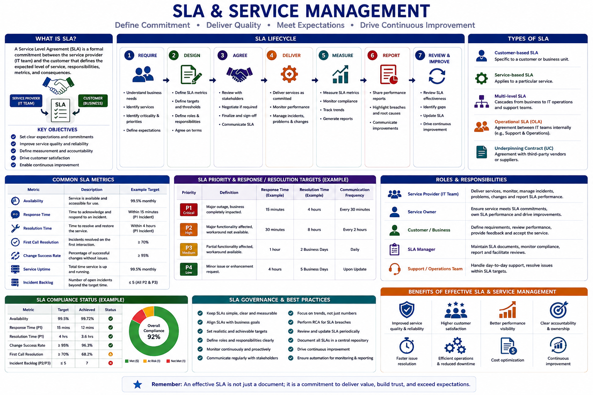

# SLA and Service Management

The following visual provides an overview of Service Level Agreement (SLA) and Service Management practices used to define service commitments, establish measurable targets, monitor service performance, manage incidents against agreed priorities, and drive continuous improvement. It highlights the SLA lifecycle, SLA types, key service metrics, priority-based response and resolution targets, roles and responsibilities, compliance monitoring, governance practices, and the benefits of effective SLA management.

  

## 1. Purpose

This document explains the importance of Service Level Agreements (SLAs) and service management practices in enterprise application support.

The objective is to ensure support teams understand service expectations, manage incidents effectively, track performance, and meet agreed service commitments.

---

## 2. What is SLA?

A Service Level Agreement (SLA) is a formal agreement between the service provider and business/customer that defines expected service levels.

An SLA specifies:

* Expected response time
* Expected resolution time
* Service availability targets
* Support coverage hours
* Escalation process
* Reporting requirements

SLAs help measure support team performance and ensure consistent service delivery.

---

## 3. SLA Components

A typical SLA includes the following components:

| Component          | Description                               |
| ------------------ | ----------------------------------------- |
| Service Scope      | Defines applications and services covered |
| Support Hours      | Defines support availability window       |
| Priority Levels    | Defines incident classification           |
| Response Time      | Time taken to acknowledge an issue        |
| Resolution Time    | Time taken to restore service             |
| Escalation Process | Defines escalation path                   |
| Reporting          | Defines service performance reporting     |

---

## 4. Incident Priority Classification

Incidents are classified based on business impact and urgency.

| Priority      | Description                                                   | Example                               |
| ------------- | ------------------------------------------------------------- | ------------------------------------- |
| P1 - Critical | Complete service outage affecting business operations         | Application unavailable for all users |
| P2 - High     | Major functionality impacted with significant business impact | Critical business process failure     |
| P3 - Medium   | Limited impact with workaround available                      | Issue affecting specific users        |
| P4 - Low      | Minor issue or service request                                | Information request or minor defect   |

---

## 5. Response and Resolution Management

### Response Time

Response time is the duration between incident creation and initial acknowledgement by the support team.

Initial response includes:

* Confirming incident receipt
* Understanding impact
* Assigning ownership
* Starting investigation

---

### Resolution Time

Resolution time is the duration required to restore service or provide a permanent solution.

Resolution activities may include:

* Applying fixes
* Implementing workarounds
* Coordinating with dependent teams
* Deploying changes

---

## 6. SLA Monitoring

SLA monitoring ensures incidents are progressing within agreed timelines.

Monitor:

* Open incidents
* SLA ageing
* Pending actions
* Priority-wise distribution
* SLA breaches

Common metrics:

* SLA compliance percentage
* Average response time
* Average resolution time
* Number of SLA breaches

---

## 7. SLA Breach Management

An SLA breach occurs when an incident exceeds the agreed response or resolution timeline.

Common reasons:

* Delay in receiving required information
* Dependency team delays
* Complex technical investigation
* Lack of ownership
* Incorrect prioritisation

When an SLA breach occurs:

1. Identify the reason for delay
2. Update incident details
3. Inform stakeholders
4. Perform root cause analysis if required
5. Define corrective actions

---

## 8. Escalation Management

Escalation ensures critical issues receive appropriate attention.

### Functional Escalation

Used when additional technical expertise is required.

Examples:

* Database team
* Infrastructure team
* Development team
* Vendor support

---

### Management Escalation

Used when:

* SLA breach risk exists
* Business impact is high
* Additional coordination is required

---

## 9. Support Team Responsibilities

Application support teams are responsible for:

* Monitoring assigned incidents
* Meeting SLA timelines
* Providing timely updates
* Performing investigation
* Coordinating with resolver teams
* Maintaining proper documentation
* Following escalation procedures

---

## 10. Service Management Metrics

Important service management metrics include:

| Metric                      | Purpose                                     |
| --------------------------- | ------------------------------------------- |
| SLA Compliance              | Measures adherence to agreed service levels |
| Mean Time to Resolve (MTTR) | Measures average resolution time            |
| Incident Volume             | Tracks number of incidents                  |
| Repeat Incidents            | Identifies recurring problems               |
| Backlog Ageing              | Measures pending incident duration          |
| Customer Satisfaction       | Measures service quality                    |

---

## 11. SLA Reporting

Regular SLA reports help understand service performance.

Reports typically include:

* Total incidents received
* Incidents resolved
* SLA compliance percentage
* SLA breaches
* Priority-wise analysis
* Major incident summary
* Improvement actions

---

## 12. Service Improvement

Continuous improvement helps improve application reliability and support efficiency.

Improvement activities include:

* Automating repetitive tasks
* Creating knowledge articles
* Improving monitoring coverage
* Reducing recurring incidents
* Optimising support processes

---

## 13. Best Practices

* Assign clear ownership for every incident
* Prioritise incidents based on business impact
* Provide regular updates during major issues
* Monitor SLA ageing regularly
* Escalate before SLA breach occurs
* Maintain accurate incident records
* Review SLA performance periodically

---

## 14. Conclusion

Effective SLA and service management practices help support teams deliver reliable and predictable services.

A structured SLA management approach enables teams to:

* Improve incident handling
* Reduce service downtime
* Meet business expectations
* Continuously improve support operations

---

**Document Purpose:** SLA and Service Management Guide
**Version:** 1.0
